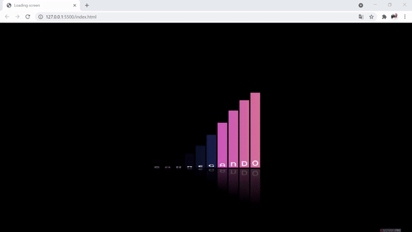

# 
Loading Screen

## About:
A loading screen created to learn animation CSS techniques with Keyframes

## Techniques:

 - [x] Animation: ease-in-out, infinite : A slowmotion from start to end;
 - [x] Keyframes -  Creat animations and trasitions;
 - [x] -webkit-box-reflect - reflection effect;

## Projeto:

  

## Technologies:

